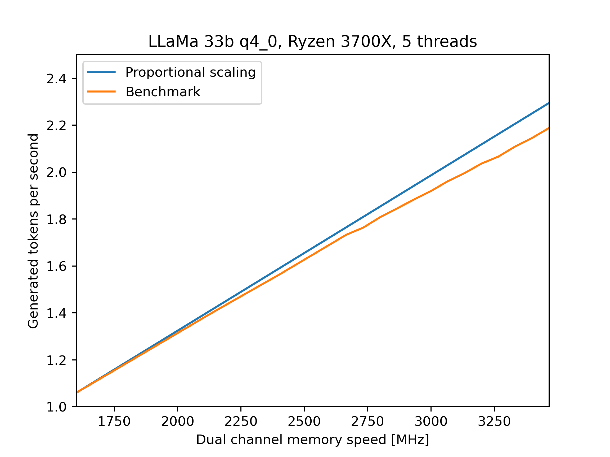
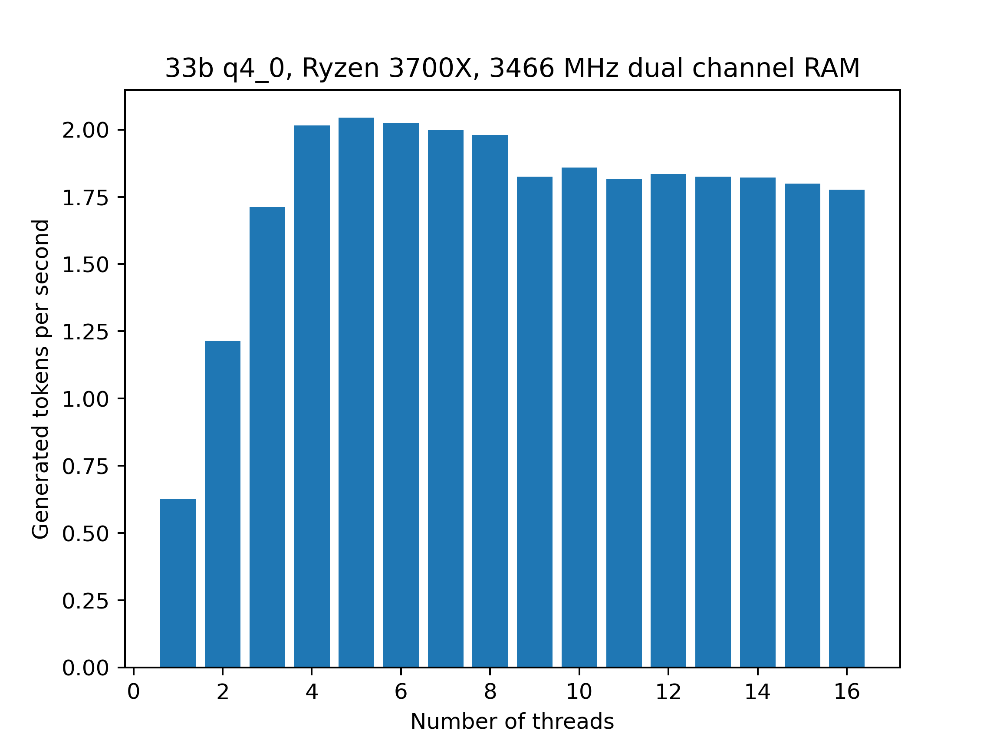
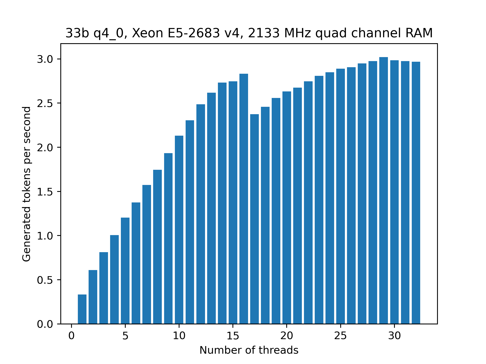

# This page is WIP

This page aims to collect performance numbers for LLaMA inference to inform hardware purchase and software configuration decisions.
Since I am a llama.cpp developer it will be the software used for testing unless specified otherwise.
"Performance" without additional context will usually refer to the performance of generating new tokens since processing the prompt is relatively fast anyways.
The usual test setup is to generate 128 tokens with an empty prompt and 2048 context.
I am primarily using q4_0 as the quantization format for testing because it is very simple in its implementation.

# Hardware

As of right now there are essentially two options for hardware: CPUs and GPUs (but llama.cpp lets you do hybrid inference).
The tradeoff is that CPU inference is much cheaper and easier to scale in terms of memory capacity while GPU inference is much faster but more expensive.
In both cases the most important factor for performance is memory bandwidth.

Hardware used for testing:

* Machine 1: AMD RX 3700X, 32 GB of dual-channel memory @ 3200 MHz, NVIDIA RTX 3090.
* Machine 2: Intel Xeon E5-2683 v4, 64 GB of quad-channel memory @ 2133 MHz, NVIDIA P40, NVIDIA GTX 1070.

## CPU

For CPU inference especially the most important factor is memory bandwidth;
the bandwidth of consumer RAM is much lower compared to the bandwidth of GPU VRAM so the actual CPU doesn't matter much.
For example, consider the following benchmark that measured tokens / second vs. memory frequency:

The data is a little old but it should still serve to illustrate the main point:
just 5 threads are enough to fully utilize the memory bandwidth provided by dual channel memory and the performance is almost proportional to just the memory frequency.
In particular, more threads can actually be detrimental since they add additional overhead:

There is a noticeable drop in performance when going from 8 to 9 threads, presumably because the RX 3700X only has 8 physical cores.
For comparison, these are the benchmark results using the Xeon system:

The number of cores needed to fully utilize the memory is considerably higher due to the much lower clock speed of 2.1 GHz and the quad-channel memory.
Still, compared to the 2 t/s of 3466 MHz dual channel memory the expected performance 2133 MHz quad-channel memory is ~3 t/s and the CPU reaches that number.
Again, there is a noticeable drop in performance when using more threads than there are physical cores (16).
The best performance was obtained with 29 threads.

## GPU

Due to their non-modular nature the primary limitation of GPUs is the amount of VRAM that they have;
if you cannot fit the entire model into VRAM your performance will be significantly worse since you will need to run part of the model on the CPU.
Some basic numbers for standard 2048 context:

| Model    | VRAM usage [MiB] |
|----------|------------------|
| 7b q4_0  |             6618 |
| 13b q4_0 |            10910 |
| 33b q4_0 |            23176 |
| 65b q4_0 |            43000 |

Due to hardware limitations the number for 65b q4_0 can only be estimated instead of actually measured.
Beyond VRAM capacity the most important performance characteristic of GPUs is their memory bandwidth.
The availability of integer intrinsics is also important since it allows for a more efficient handling of quantized data;
for NVIDIA GPUs this means Turing/Volta or later.
