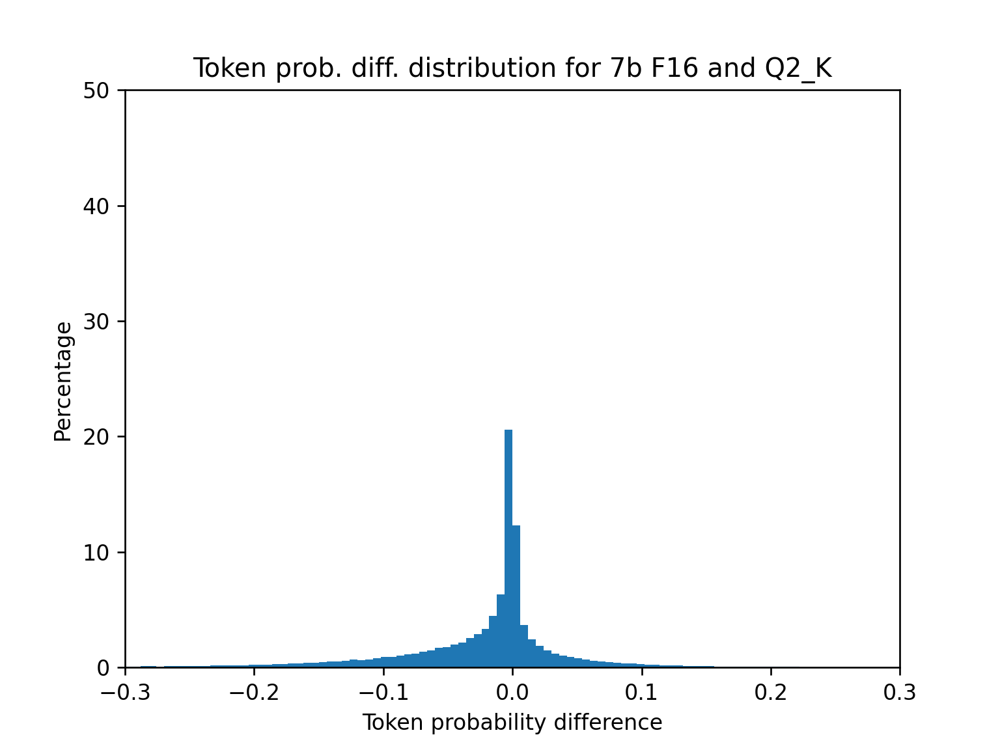
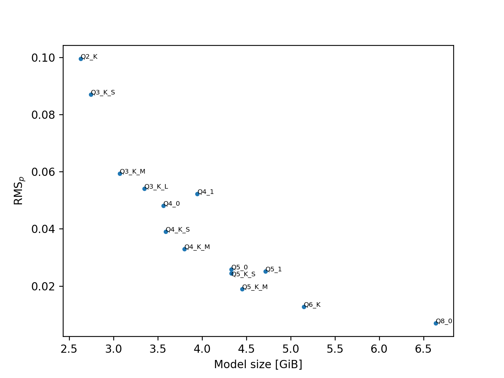
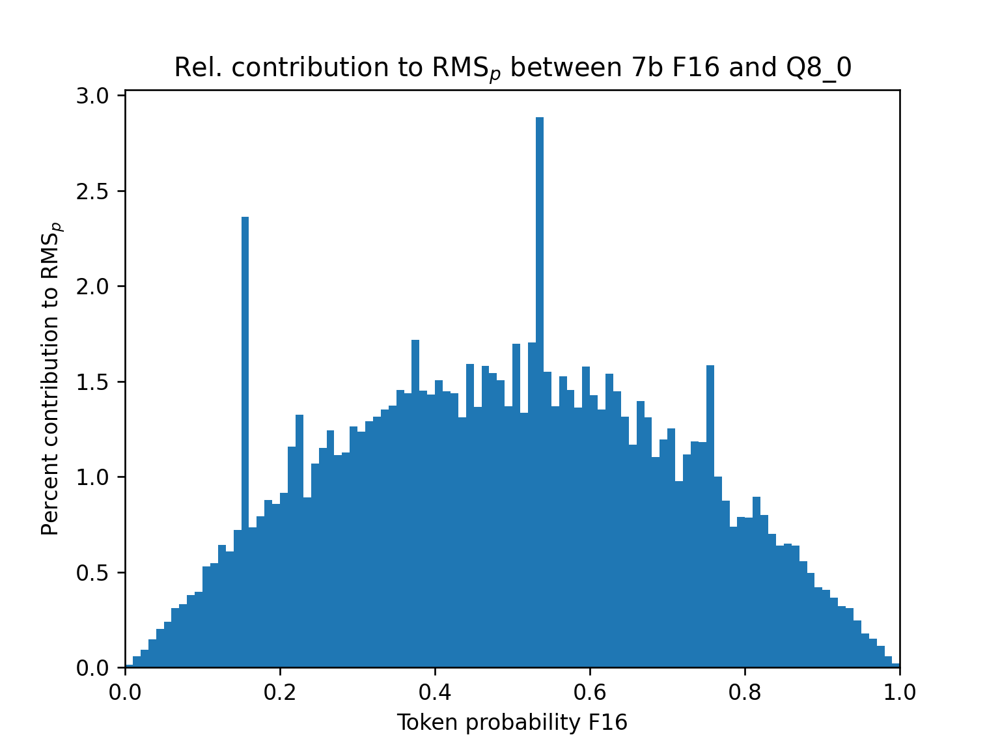
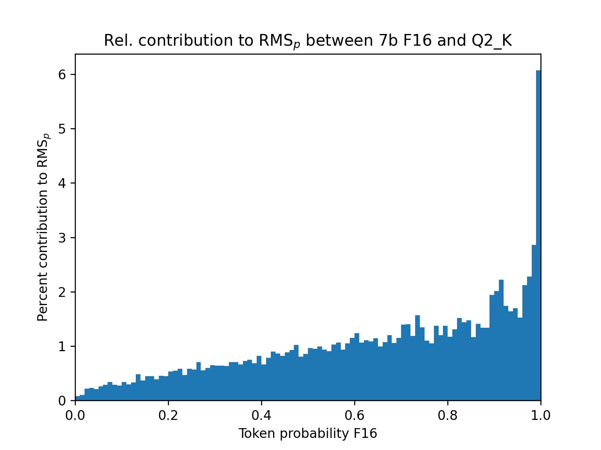

# llama.cpp Quantization Metrics

Language models are usually trained as 16 bit floats but for inference they are frequently *quantized* to lower precision which results in both faster inference and reduced memory use.
A typical quantization format uses something like 2-8 bits per weight (BPW) for storing the information of the unquantized model.
However, this quantization and subsequent loss in precision lowers the quality of the model performance.
This can be observed subjectively but especially in order to optimize quantization schemes an objective measure of quality loss is desirable.
Currently a popular approach is to calculate the *perplexity* of both the quantized and unquantized models on a large corpus of text and to optimize the increase of the perplexity of the quantized model.
However, this blog post aims argue that this is a suboptimal metric and that the *root mean square* of the *token probabilities* is a better metric.

All numbers and plots in this blog post were obtained by running the `perplexity` binary of llama.cpp with the newly added `--logdir` CLI argument to generate YAML log files.
The `wikitext.text.raw` file (obtainable via `scripts/get-wikitext-2.sh`) was used as input.
These log files were then analyzed using a Python script.
All relevant files can be found [on GitHub](https://github.com/JohannesGaessler/johannesgaessler.github.io/tree/master/llamacpp_quantization_metrics).
The used models are LLaMA 2 F16 and its llama.cpp quantizations.

Let us start with considering how a model produces a probability distribution for all possible $N$ tokens in its vocabulary.
First the model puts out raw *logits* $l_n$ for each token.
These logits cannot be interpreted sensibly on their own but they can be converted to probabilities by using *softmax*:

$$p_n := \mathrm{softmax}(l_n) = \exp(l_n) \cdot \left[ \sum_{j=1}^N \exp(l_j) \right]^{-1}.$$

From these probabilities the model can then sample to produce a prediction for the next token.
To calculate perplexity the model is instead given a text consisting of $M$ tokens.
There is only a single token that actually appears at position $m$ and the model assigns it a probability $p_m$.
We can now calculate the perplexity like this:

$$\mathrm{PPL} = \exp \left(- \frac{1}{M}  \sum_{m=1}^M \ln p_m \right) .$$

So effectively the perplexity is the exponential of the average *negative log-likelihood* per token.
The perplexity is by definition positive and a lower value corresponds to better predictions.
Without further investigation we can also notice an asymmetry:
for $p_m \rightarrow 1$ the perplexity is bounded at 0 but for $p_m \rightarrow 0$ it can grow indefinitely.

If we now quantize one or more tensors of the model this necessarily introduces *rounding error* somewhere in our model.
If the rounding error is small enough then it will simply propagate to the logits and add a bit of noise there.
So let us begin by looking at the difference in the correct logits for Q8_0 which uses 8.5 BPW relative to F16:

The logit differences mostly follow a Gaussian distribution (the tails are too fat) and the mean of the distribution is close to 0.
The distribution also only weakly depends on the output probability of the correct token for the unquantized model:

For this plot the data was histogrammed to 10 equal-sized bins of size 0.1.
The markers indicate the means of the values for a given bin while the error bars indicate their standard deviation.
The difference in logits seems to be larger for those tokens where the F16 probability was highest but the mean difference is still much smaller than the standard deviation of the differences.
On the other extreme end, this is what the corresponding plots look like for Q2_K (3.35 BPW on average across the model):

For this quantization format the first thing to notice is that the absolute differences in logits are much larger.
This should not be surprising given the much larger rounding error.
But what is also noticeable is that the mean of the distribution has significantly shifted downwards, especially for tokens where the unquantized model performed well.
This general trend is mostly continuous as the BPW of the quantization scheme are varied.
However, there are some weird edge cases like Q5_0 where the values of the correct logits on average actually *increase*:

Regardless, both subjectively and objectively (as measured by perplexity) Q5_0 performs worse than F16.
This is because any kind of noise on the logits is detrimental.
The more noise there is the more does the distribution of token probabilities get pushed towards a *uniform distribution* where each token has a constant and equal probability.
But at this point we should remind ourselves that the logits are not immediately equivalent to those aforementioned probabilities.
Due to the use of softmax the logits could (in theory) be varied without affecting the actual token probabilities.
So let us look at how quantization affects the correct token probabilities for Q8\_0 and Q2\_K:

We can notice that the peak for q8\_0 is much sharper than for Q2\_K and that the Q2_K distribution is skewed towards negative values (the quantized model performing worse). However, for both quantization types the most likely change in token probability is little to no change at all.
The reason for this becomes apparent if we look at the token probability distribution of the unquantized model:

The token probabilities have two clusters: one close to 0 and one close to 1.
In those regions softmax is very flat so changes in the logits result in only small changes in the token probabilities.
Now, let us think back to the beginning of this blog: the goal is to find a good metric for measuring the quality loss from quantization.
The metric proposed here is the *root mean square* of the differences in token probabilities:

$$\mathrm{RMS}_p = \sqrt{ \frac{1}{M} \sum_m \left[ p_m^\mathrm{Q} - p_m^\mathrm{F16} \right]^2 },$$

where the upper indices of the probabilities indicate whether the probabilities correspond to the unquantized F16 or the quantized model.
The index in the sum is supposed to go from 1 to M but for some reason putting this into the LaTeX code breaks the rendering on GitHub.

Effectively the above metric calculates the standard deviation of the probability differences assuming that the mean of the differences is 0.
This approximation is unproblematic because the mean of the differences is small relative to their standard deviations (lowest ratio is for Q2_K where the standard deviation is ~4 times larger than the absolute value of the mean).
If we now compare plots of the perplexities and the $\mathrm{RMS}_p$ of the different quantization formats we find:

Though there are some differences (see the Q5 values) the plots overall look rather similar.
So why would you prefer one metric over the other?
The first reason is that while perplexity is very abstract the interpretation of $\mathrm{RMS}_p$ is more straightforward:
it is an estimate of the standard deviation of the changes in token probability from quantization.

The two metrics are also not equally sensitive to the same areas of token probability.
Perplexity sharply increases when token probabilities get close to 0.
Pair this with the fact that there are a lot of low-probability tokens in the first place and you find that the perplexity value is overwhelmingly dominated by low-probability tokens:

This is an issue if you consider e.g. top-p sampling.
With this sampling method low-probability tokens would never be considered for sampling in the first place.
So changes on the probabilities of those tokens would not make any difference for the actual generation of text.
If we look at the differences in perplexity when calculated on only a small subset of the total tokens (equally sized bins of size 1% in token probability) we find that the differences in perplexity are also the largest for low-probability tokens:

However, there are some weird things happening for some of the quantization formats:

There are instances where the quantized models have a better perplexity on the lowest-probability bin < 1%.
I'm not entirely sure what is happening here but I hypothesize that the unquantized model is confidently wrong about something in the text.
Through the process of quantization that confidence is then sometimes eroded away and the model is punished less severely for its wrong confidence.
In any case, you can completely suppress this effect by filtering out all tokens where the unquantized model has a probability < 0.1% of being correct (these account for 4.2% of all tokens):

Filtering out these very low-probability tokens also reduces how much higher the perplexity difference for Q8_0 is for the lowest-probability bin:

By comparison, the contributions to $\mathrm{RMS}_p$ mostly come from medium-probability tokens:

Notably all contributions to $\mathrm{RMS}_p$ are by definition non-negative.
Unlike with a difference in perplexity, it is therefore impossible for multiple contributions to cancel each other out.
For quantization types that use less than 4 BPW for all layers (Q2\_K, Q3\_K\_S) there are large $\mathrm{RMS}_p$ contributions from high-probability tokens:

Still, this is less lopsided than the equivalent situation with perplexity.
My personal interpretation of the plots is that Q2\_K and Q3\_K\_S begin to perform poorly on a lot of tokens that the unquantized model was able to get correct with high confidence.
For comparison, this is the plot for Q3\_K\_M:

There is still a comparatively high contribution from high-probability tokens but the effect is already much smaller.

Now, so far we have only talked about the metrics in and of themselves but there are also practical differences to calculating them.
When calculating perplexity we are by definition limited to the "correct" tokens that actually appear in the text that we use as input.
However, If we are only concerned with replicating the output of the unquantized model as closely as possible we could instead be looking at the probability differences of any token.
It should also be possible to generalize $\mathrm{RMS}_p$ for more than one token probability per token from the input text.
You could for instance, compare the probabilities of the 10 most likely tokens for the unquantized model.
This would give you ten times more data points per token of input text and significantly reduce the amount of input text required to get sufficient precision.
For reference, the uncertainty of $\mathrm{RMS}_p$ when using only the correct tokens on wikitext can be estimated to be ~1% if you assume a Gaussian distribution.

The way to implement calculating $\mathrm{RMS}_p$ from more than one input token could be as follows:
First, calculate reference probabilities using the unquantized model.
During the calculation, select some subset of probabilities and write them to a file (combinations of tokens and their assigned probabilities).
Next, re-run the calculations with the quantized model and provide the file as input.
You can now select the tokens specified in the file and calculate the squared error for each token.
The final result would then just be $\mathrm{RMS}_p$ using the mean of all squared errors.

One issue that could arise from calculating more than one squared error value per input token is that due to the nature of softmax the probabilities will be correlated.
So the rate of convergence towards the final value that you would see with infinite tokens should be slower than just the rate of convergence with 1 token multiplied with the number of tokens considered.
The rate of convergence should always increase by adding more tokens however (but you will need to be careful when trying to assign an uncertainty to the final result).

Finally, what I did not explore is the portability of $\mathrm{RMS}_p$ across multiple input texts and models.
The perplexity calculated on two different input texts is going to be different, but $\mathrm{RMS}_p$ may end up being the same or at least very similar - this may be worth exploring.

# Appendix

Plots for all quantization formats, including some that I did not include in this blog post (e.g. for logit RMS) can be on my [GitHub page](https://github.com/JohannesGaessler/johannesgaessler.github.io/tree/master/llamacpp_quantization_metrics). The GitHub page also includes the Python script that I used to generate the plots.
Here is also a table of my results:

| Quantization format | Model size [GiB] | Perplexity | RMS logits               | $\mathrm{RMS}_p$         | Mean prob diffs | STD prob diffs |
|---------------------|------------------|------------|--------------------------|--------------------------|-----------------|----------------|
| Q4_0                | 3.56             | 5.9667     | 6.4194e-01 +- 2.6739e-03 | 4.8091e-02 +- 3.2271e-04 | -6.1943e-03     | 4.7691e-02     |
| Q4_1                | 3.95             | 6.0010     | 7.4797e-01 +- 3.1986e-03 | 5.2213e-02 +- 3.5856e-04 | -8.3283e-03     | 5.1544e-02     |
| Q5_0                | 4.33             | 5.8291     | 3.3836e-01 +- 2.5083e-03 | 2.5776e-02 +- 2.0147e-04 | -1.0959e-03     | 2.5753e-02     |
| Q5_1                | 4.72             | 5.8531     | 3.3836e-01 +- 2.5083e-03 | 2.5776e-02 +- 2.0147e-04 | -1.0959e-03     | 2.5753e-02     |
| Q8_0                | 6.64             | 5.8013     | 7.4246e-02 +- 7.6008e-04 | 6.9985e-03 +- 8.1228e-05 | -7.9424e-06     | 6.9985e-03     |
| Q2_K                | 2.63             | 6.4462     | 1.6808e+00 +- 9.3935e-03 | 9.9569e-02 +- 5.4573e-04 | -2.7971e-02     | 9.5560e-02     |
| Q3_K_S              | 2.75             | 6.2947     | 1.3440e+00 +- 4.2525e-03 | 8.7031e-02 +- 4.9141e-04 | -2.2907e-02     | 8.3962e-02     |
| Q3_K_M              | 3.07             | 6.0272     | 7.8546e-01 +- 2.6638e-03 | 5.9372e-02 +- 3.9066e-04 | -1.1507e-02     | 5.8247e-02     |
| Q3_K_L              | 3.35             | 5.9872     | 7.2806e-01 +- 2.5221e-03 | 5.4021e-02 +- 3.7963e-04 | -8.9787e-03     | 5.3269e-02     |
| Q4_K_S              | 3.59             | 5.8890     | 5.0052e-01 +- 2.0265e-03 | 3.9054e-02 +- 2.7155e-04 | -5.0621e-03     | 3.8725e-02     |
| Q4_K_M              | 3.80             | 5.8803     | 4.2331e-01 +- 1.9717e-03 | 3.2940e-02 +- 2.5994e-04 | -4.3586e-03     | 3.2650e-02     |
| Q5_K_S              | 4.33             | 5.8222     | 3.2355e-01 +- 1.7203e-03 | 2.4456e-02 +- 1.9604e-04 | -1.1886e-03     | 2.4427e-02     |
| Q5_K_M              | 4.45             | 5.8282     | 2.3983e-01 +- 1.2860e-03 | 1.8893e-02 +- 1.5800e-04 | -1.0047e-03     | 1.8866e-02     |
| Q6_K                | 5.15             | 5.8095     | 1.6149e-01 +- 1.3805e-03 | 1.2712e-02 +- 1.1252e-04 | -5.2424e-04     | 1.2701e-02     |
